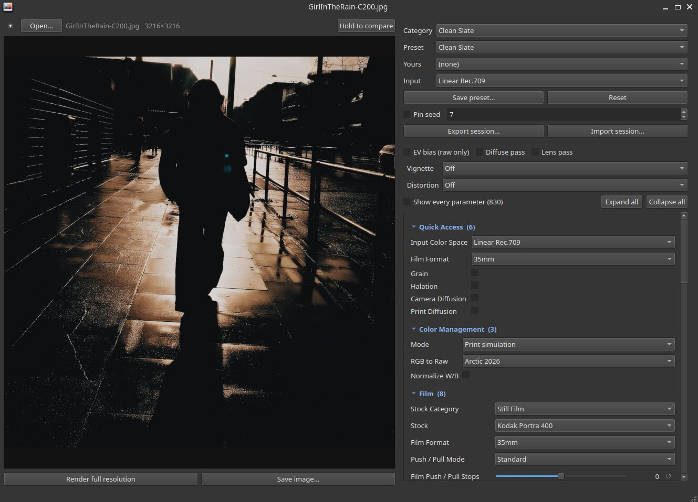

# ofx-photo

A minimal [OpenFX](https://openeffects.org/) host for applying OFX plugins to **still
photographs** on Linux, with a command line tool and a small GUI on top.

Written to run **spektrafilm**, a film-emulation plugin by Aedan Diez
([site](https://spektrafilm.114c.de/) · [source](https://github.com/andreavolpato/spektrafilm)
· [downloads](https://spektrafilm.114c.de/#download)). The vendor ships that plugin for
Linux, but the standalone photo application is macOS only, and the documented hosts —
DaVinci Resolve Studio and Nuke — are expensive video tools that are awkward for single
images. This project is the missing host, not a fork of the plugin.

```sh
cmake -S . -B build && cmake --build build     # build the host
./install-desktop.sh                           # menu entry and "Open With"
./spektra-gui photo.NEF                        # or just open it from the menu
```



---

## Contents

- [Why this exists](#why-this-exists) · [Install](#install) · [The plugin is not included](#the-plugin-is-not-included)
- [The GUI](#the-gui) · [The command line](#the-command-line) · [Sessions](#sessions-the-gui-as-json)
- [Presets](#presets) · [Extra passes](#extra-passes-the-companion-plugins) · [Colour](#colour-what-goes-in-and-what-comes-out)
- [Raw files](#raw-files) · [Tests](#tests) · [How it works](#how-it-works) · [Gotchas](#gotchas-worth-knowing)

---

## Why this exists

OFX is a *plugin* API, so a plugin needs a host to run inside, and there is no simple,
free, photo-oriented OFX host on Linux. This is one.

It turns out to be a small job for this class of plugin:

- it is a plain **Filter**-context effect — one input, one output
- it declares **CPU render support**, so the host only has to hand it float buffers
- any GPU work is its own business, internal and invisible to the host
- it references only 7 OFX suites: Property, Parameter, ImageEffect, Memory, MultiThread,
  Message and Progress

## Install

Requirements:

| | |
|---|---|
| Linux x86_64, glibc 2.28+ | |
| C++17 compiler and CMake | builds `spektra-render` |
| Vulkan 1.2 and a working driver | required by the spektrafilm plugin itself |
| Python 3 with `numpy`, `Pillow` | the CLI |
| `PyQt5` | the GUI |
| `libraw-bin` (`dcraw_emu`) | camera raw, optional |
| ImageMagick (`convert`) | 16-bit output and ICC conversion, optional |
| `exiftool` | carrying metadata onto the result, optional |

Either run it from the checkout:

```sh
cmake -S . -B build && cmake --build build
./tests/test_spektra.py                        # check it works
./install-desktop.sh                            # --uninstall reverses it
```

or install it into a prefix:

```sh
cmake -S . -B build -DCMAKE_INSTALL_PREFIX=~/local
cmake --build build
cmake --install build
```

That places `spektra`, `spektra-gui` and `spektra-render` in `<prefix>/bin`. The default
prefix is `~/.local`, which needs no root.

The **menu entry and icons go to `$XDG_DATA_HOME`** (`~/.local/share`) whatever the prefix,
because a desktop session reads its environment at login and never sees a shell rc — put
them under `~/local/share` and the launcher simply never appears, however `PATH` is set.
Pass `-DDESKTOP_TO_PREFIX=ON` to override that.

So the only thing a non-standard prefix needs is `PATH`, which the installer prints:

```sh
export PATH="$HOME/local/bin:$PATH"
```

The three tools find each other by sitting together in one `bin`, so a prefix can be moved
or renamed freely.

`install-desktop.sh` adds a **Spektra Photo** entry to the applications menu and to the
*Open With* list for JPEG, PNG, TIFF and the common raw formats. It writes only under
`$HOME` and needs no root. To make it the default for a format:

```sh
xdg-mime default ofx-photo.desktop image/x-nikon-nef
```

## The plugin is not included

**No plugin binaries are in this repository, by design.** They belong to their vendor, and
their resources exceed GitHub's file size limit. Obtain the plugin separately and install it. The
tools search, in order:

1. every entry of **`$OFX_PLUGIN_PATH`** — set this and it always wins
2. `/usr/OFX/Plugins`, `/usr/local/OFX/Plugins`, `/opt/OFX/Plugins`
3. `~/OFX/Plugins`, `~/.OFX/Plugins`, `~/.local/share/OFX/Plugins`, `~/local/OFX`, `~/.local/OFX`
4. beside this checkout, which is where an unpacked download sits

Each is tried directly and with a `Plugins/` subdirectory. Check which one won with
`./spektra --info any.jpg` or simply override it:

```sh
./spektra photo.jpg out.jpg --bundle /usr/OFX/Plugins/spektrafilm.ofx.bundle
```

---

## The GUI

The photograph is on the left, the controls on the right: preset at the top, then the
extra passes, then the five tabs. Two details visible above — **EV bias** is greyed out
and labelled *raw only*, because the open file is a JPEG; and each group header carries
its parameter count.

```sh
./spektra-gui                       # empty, then Open…
./spektra-gui photo.NEF             # straight to a photo
./spektra-gui a.jpg b.jpg c.jpg     # one window each
./spektra-gui look.json             # straight to a saved session
```

### From a photo catalog

Taking several paths means a catalog can hand over a whole selection.
[npc](https://github.com/Try2Code) drives it from its config with no glue code:

```toml
[[action]]
key  = "s"
name = "Spektra (JPG)"
cmd  = ["spektra-gui", "{jpg}"]
mode = "detach"

[[action]]
key  = "S"
name = "Spektra (RAW)"
cmd  = ["spektra-gui", "{raw}"]
mode = "detach"

[[export]]
name = "portra"
cmd  = ["spektra", "{src}", "{dst}", "--preset", "Marty - Warm", "--raw-ev-bias"]
```

| Control | What it does |
|---|---|
| ☀ / ☾ (far left) | dark or light theme, remembered between runs |
| **Open…** | JPEG, PNG, TIFF, and raw; drop a file on the window, or pass paths on the command line |
| **Hold to compare** | press and hold to see the untouched original |
| **Category / Preset** | the 88 bundled presets |
| **Yours** | presets you saved, from `~/Documents/spektrafilm/presets` |
| **Input** | input colourspace; `Linear Rec.709` suits photos and raw |
| **Save preset… / Reset** | store the current look; drop your edits |
| **Pin seed** | fix every random seed so renders repeat exactly |
| **Export / Import session** | the whole window state as JSON |
| **EV bias** | undo the camera's exposure compensation; **raw only**, and greyed out with the reason for anything else |
| **Diffuse pass / Lens pass** | extra passes through the companion plugins |
| **Show every parameter** | all 830, grouped and collapsed |
| **Render full resolution** | the preview is downscaled; this is the real thing |

Numeric parameters are **sliders** with a value readout and a ↺ button that returns them
to whatever the preset said. The button greys out when the value is already there, so you
can see at a glance what you have changed.

The controls sit in five tabs. That arrangement is **not mine**: it is taken from the
napari GUI in Andrea Volpato's
[spektrafilm](https://github.com/andreavolpato/spektrafilm), which divides its controls
the same way. Tried against one long scrolling column, his grouping read better, so this
follows it.

| Tab | Holds |
|---|---|
| **MAIN** | Quick Access, Color Management, Film, Scanner, Tonality, Info |
| **FILM** | Grain, Halation, Diffusion, DIR Couplers and Sharpening, film chemistry, Filtering, Film Plane |
| **PRINT** | Print, Advanced Print Chemistry, Illuminant Transfer |
| **ADVANCED** | Pre-Adjustments, Colour Adaptation, and the lens and film-damage groups |
| **CONFIG** | Presets, **LUT Export**, Manage, Backend |

Groups fold within each tab. **Quick Access, Color Management, Film, Print** and **Grain**
are shown by default, along with everything in CONFIG — 66 controls. The remaining ~800
are one tick box away.

`--single-column` restores the older layout, one scrolling list with Effects at the
bottom. The two show exactly the same 33 groups and 365 controls; a test asserts it.

**CONFIG is worth a look.** Besides the preset buttons it carries clipboard copy/paste of
settings, user defaults, a factory reset, an RGB density curves overlay, the
Production/Realtime quality switch, and **LUT Export**.

### Exporting a LUT

**Export LUT** in CONFIG writes a 33 or 65 point `.cube` of the current look. The GUI sets
the colourspaces, so a LUT exported from a photo session is titled *Linear Rec.709 to
sRGB* and is usable in anything that reads `.cube`.

It carries the colour and nothing else. The plugin says so in the file it writes:

```
# Disabled for LUT export: grain, halation, DIR diffusion
```

Grain, halation and diffusion are spatial — they depend on neighbouring pixels — so no
3D LUT can express them, whatever its resolution. Exported LUTs are covered by the
plugin's own separate LUT licence.

## The command line

```sh
./spektra in.jpg out.jpg --preset "Marty - Warm"
./spektra in.NEF out.tif --preset "CineStill 800T" --bit-depth 16
./spektra in.jpg out.jpg --set filmExposureEv=1.5 --set quickGrainEnabled=false
./spektra in.NEF out.jpg --raw-ev-bias                    # undo -1.67 EV, say
./spektra shots/*.NEF outdir/ --preset "Vintage Faded" --jobs 2
```

Finding your way around 830 parameters:

```sh
./spektra --list-presets                  # 88 bundled, plus your own
./spektra --list-params --grep grain      # search names, labels and hints
./spektra --list-stocks film              # which films each Stock Category offers
./spektra --list-stocks print             # and which papers
./spektra --info photo.NEF                # EXIF, ICC, and decoded statistics
```

`--info` is the first thing to reach for when a render looks wrong: it reports what the
file claims to be and what it actually decoded to.

| Option | |
|---|---|
| `--preset NAME` | a bundled preset, matched loosely, with suggestions when wrong |
| `--user-preset NAME` | one of your own |
| `--save-preset NAME` | store the current settings as a new one |
| `--set NAME=VALUE` | any of the 830 parameters, repeatable |
| `--bundle NAME\|PATH` | `film`, `diffuse`, `lens`, `flow`, or a path |
| `--chain NAME[:PRESET]` | run another pass afterwards, repeatable |
| `--seed N` | pin every random seed |
| `--preview [PX]` | render small and fast, as the GUI preview does |
| `--raw-ev-bias` | undo the camera's EV compensation on raw |
| `--strip-metadata` | do not carry the original's metadata onto the result |
| `--input-colorspace` | override the input transform |
| `--bit-depth 8\|16`, `--quality N` | output |
| `--jobs N` | images in parallel |
| `--session SPEC`, `--dump-session` | see below |

Preset names are matched loosely and suggest alternatives when wrong, which helps: the
real ones are easy to mistype — `Chromium-Noir`, `CineStill 800T`, `Marty - Warm`, `OIL!`.

## Sessions: the GUI as JSON

Everything the window holds is a session, so a look can leave the GUI and be replayed from
the terminal, **byte for byte**:

```sh
./spektra photo.jpg out.jpg --preset "OIL!" --seed 7 --dump-session look.json
./spektra --session look.json
./spektra --session '{"input":"a.jpg","output":"b.jpg","seed":7}'    # inline
./spektra --session - < look.json                                    # stdin
./spektra-gui look.json                                              # back to the GUI
```

```json
{
  "input": "photo.NEF",
  "output": "out.jpg",
  "bundle": "spektrafilm",
  "preset": {"category": "Creative", "selection": "Marty - Warm"},
  "user_preset": null,
  "input_colorspace": "Linear Rec.709",
  "output_colorspace": "sRGB",
  "params": {"filmExposureEv": "1.5"},
  "seed": 7,
  "raw_exposure_bias": true,
  "chain": [{"bundle": "lens",
             "params": {"quickVignetteEnabled": "true",
                        "quickVignettePreset": "Vintage Mechanical"}}],
  "preview": {"long_edge": 1100},
  "output_options": {"bit_depth": 8, "quality": 95}
}
```

In the GUI: **Export session… / Import session…**. And to watch it live:

```sh
SPEKTRA_SESSION_OUT=/tmp/s.json ./spektra-gui     # rewritten on every preview
./spektra --session /tmp/s.json                   # replay whatever it is doing now
```

A session may carry any of the 830 parameters, including ones the panel does not show;
those survive a round trip through the GUI untouched.

## Presets

Preset save and load are implemented **inside the plugin**, so this project contains no
preset serialisation at all — it sets a dropdown and presses a button. Presets you save
are ordinary `.spkpreset` files in `~/Documents/spektrafilm/presets`, usable in any other
host.

88 come bundled: 1 Clean Slate, 47 Creative, and 40 Neutral film/print stock pairings such
as `Kodak Vision3 250D on 2383` and `Ilford HP5 Plus on Ilfobrom Galerie FB K1`.

```sh
./spektra --list-presets
./spektra in.jpg out.jpg --preset "Chromium-Noir"
./spektra in.jpg out.jpg --set … --save-preset "My Look"
./spektra in.jpg out.jpg --user-preset "My Look"
```

## Extra passes: the companion plugins

The family ships four bundles. They are **one engine with different defaults**, not four
different effects:

| Short name | Differs from `spektrafilm` by |
|---|---|
| `film` (default) | — |
| `diffuse` | camera diffusion on, spatial scale 35 |
| `lens` | only a Resolve-oriented default colourspace |
| `flow` | motion based, of little use for stills |

So `--bundle lens` alone does nothing the main plugin cannot, and a **bare lens pass is a
verified no-op**. What they add is running *more than one pass*, as a node graph would:

```sh
./spektra photo.jpg out.jpg --preset "Marty - Warm" --chain diffuse
./spektra photo.jpg out.jpg --bundle diffuse --preset "OIL!"
```

### The companion bundles are stripped

`_lens` and `_diffuse` ship **without** the spectral data and without the preset library:

| | `spektrafilm` | `_flow` | `_lens` | `_diffuse` |
|---|---|---|---|---|
| `SpektraSpectralUpsampling.f32` (103 MB) | ✅ | ✅ | ✗ | ✗ |
| `SpektraHanatos2025Spectra.f32` (12 MB) | ✅ | ✅ | ✗ | ✗ |
| `SpektraOutputGamutCompression.f32` | ✅ | ✅ | ✗ | ✗ |
| bundled presets | 88 | 88 | 0 | 0 |

Two consequences:

- **`--preset` mostly does not work against `lens` or `diffuse`.** They offer 6 entries
  rather than 88, so a name from the main library will not resolve. Drive them with
  `--set` and per-pass `params` instead, which is what `--chain` does anyway.
- **One unexplained failure.** A save once reported `Unable to locate
  SpektraHanatos2025Spectra.f32 for Vulkan Hanatos RGB-to-raw`, and the missing files make
  these bundles the obvious suspect — but that was not reproducible. All four RGB-to-Raw
  methods, Hanatos included, render from `lens` and `diffuse` here, even with the bundle
  copied somewhere on its own with no sibling beside it, so the plugin finds the data by
  some route that is not documented and not the `~/.cache/spektrafilm` pipeline cache. If
  you hit it, export the session: it can then be replayed exactly.

A pass only bites once its effects are switched on, which is easiest to express in a
session:

```json
"chain": [{"bundle": "lens",
           "params": {"quickVignetteEnabled": "true",
                      "quickVignettePreset": "Vintage Mechanical"}}]
```

Each pass reads in whatever encoding the pass before it wrote.

## Colour: what goes in and what comes out

The plugin expects **scene-linear** input and returns **display-encoded** output.

Going in, the tools hand it linear pixels and set the input colourspace to match:

- **JPEG, PNG, TIFF** — sRGB decoded to linear. An embedded ICC profile that is not sRGB
  (Adobe RGB, ProPhoto) is converted first; otherwise those files would be read as sRGB
  and every colour would shift.
- **Raw** — already linear from the decoder, with the camera's white balance applied.

Coming out, the plugin applies its own output transform, so what it returns is already
sRGB. The writers hand those pixels straight to the file. **Encoding them a second time
lifts shadows by up to 70 levels out of 255**, which is easy to do by accident and looks
merely "bright and filmic" rather than obviously broken.

## Metadata

The render keeps the photograph's metadata: EXIF, XMP, IPTC, GPS, maker notes — whatever
the original carried, copied with `exiftool`. It matters most for raw, where Pillow alone
carried almost nothing: a NEF that reached its JPEG with **23 tags** now arrives with
**201**.

Three things are corrected rather than copied, because they would otherwise describe the
source instead of the file being written:

| Tag | Why |
|---|---|
| **Orientation** | reset to 1, because the rotation is already applied to the pixels — copying it would have a viewer turn the picture a second time |
| **ColorSpace**, ICC | the output is sRGB whatever the source was tagged as, so the source profile is dropped |
| **Pixel dimensions** | they differ whenever the render was resized |

`ProcessingSoftware` and `XMP:CreatorTool` record the render and the preset used.
`--strip-metadata` turns the whole thing off, leaving only the structural tags a JPEG
cannot avoid. Without `exiftool` installed you get the basic EXIF block Pillow can write
and a note on stderr saying so.

## Raw files

Raw is decoded by `dcraw_emu` (`libraw-bin`) to linear 16-bit with camera white balance.

Raw and the camera's own JPEG of the same frame **will not match**, and the raw is the
more correct input. The JPEG has the camera's Picture Control baked in — a contrast curve,
highlight rolloff and baseline gain — which cannot be undone by linearising. Measured on
one frame:

| percentile | JPEG vs raw |
|---|---|
| p25 (shadows) | −0.46 stops |
| p50 (midtones) | −0.02 stops |
| p90 | +1.47 stops |
| p99 (highlights) | +2.16 stops |

Shadows down, midtones pinned, highlights lifted: a tone curve, not a brightness offset.
So a raw file looks flat and dark until you place the exposure yourself, either with the
**Exposure EV** slider in the Film group or:

```sh
./spektra photo.NEF out.jpg --set filmExposureEv=1.67
```

If the shot carries an exposure compensation, **EV bias** / `--raw-ev-bias` undoes it, so
a frame shot at −1.67 EV lands where its JPEG would. It applies to raw only: a JPEG
already carries that compensation in its rendering, and undoing it there would apply it
twice.

## Tests

```sh
./tests/test_spektra.py                                 # synthetic chart
./tests/test_spektra.py --photo p.jpg --raw p.NEF       # your own files
./tests/test_spektra.py --quick -k session              # narrow it down
```

126 checks across the host, presets, determinism, parameter overrides, sessions, output
encoding, chained passes, exposure bias, image I/O, raw scaling, ICC handling and the GUI
model. **The GUI runs offscreen**, so the whole suite needs no display and no clicking.

They earn their keep: the first run found 16-bit output silently writing 8-bit, and
sessions silently dropping 806 of 830 parameters.

### On GitHub

`.github/workflows/ci.yml` runs on every push in two stages:

- **quick** — builds the host, byte-compiles the Python, runs the ~30 checks that need no
  plugin, and installs the desktop entry through `desktop-file-validate`.
- **full** — downloads the official Linux archive from the vendor's site, installs it, and
  runs everything.

The runners have no GPU, so rendering falls to **lavapipe**, Mesa's software Vulkan. That
works: the plugin enumerates it like any other device. Compiling its 79 shader pipelines
costs about 25 s the first time and roughly 4 s a render afterwards, so both the 110 MB
archive and `~/.cache/spektrafilm` are cached between runs. Bump `PLUGIN_VERSION` in the
workflow to pick up a newer plugin.

The archive is fetched for use and never committed or republished; nothing about the
plugin enters this repository.

## How it works

```
 photo.jpg ──┐
 photo.NEF ──┤  spektra (Python)
 photo.tif ──┘   · decode (Pillow / dcraw_emu), ICC to sRGB
                 · sRGB → linear, orientation, optional EV bias
                 · resolve preset and parameter overrides
                       │
                       │  .sfraw  (float32 RGBA, y-up)
                       ▼
                 spektra-render (C++)
                  · dlopen the .ofx bundle
                  · describe → describeInContext(Filter) → createInstance
                  · set parameters, bind clips, render one frame
                       │
                       │  .sfraw, repeated for each chained pass
                       ▼
                 spektra (Python)
                  · quantise, write JPEG / PNG / TIFF
```

The host runs as a **one-shot child process**: the plugin initialises Vulkan and allocates
sizeable GPU resources, so a fresh process per render guarantees clean teardown and keeps
a plugin crash from taking the GUI down with it.

Both the GUI and the CLI build their parameter lists from what the plugin reports at
describe time, and share one render pipeline. **No parameter names are hard-coded**, so
the tools survive plugin updates.

## Gotchas worth knowing

**Renders vary between runs unless you pin the seed.** The plugin randomises its grain,
gate weave, flicker and dust seeds for each new instance. `--seed N` fixes all of them.

**Choosing a preset for an effect switches that effect on.** The plugin keeps the preset
and the enable as separate parameters, so picking a vignette preset while vignette is off
does nothing at all. The GUI arms it for you and says so.

**The preview is downscaled** to 1100 px. Grain and halation are resolution dependent, so
use **Render full resolution** before saving to see the real thing.

**Some dropdowns rewrite others.** Choosing a Stock Category replaces the Stock list —
Motion Picture offers 14 films, B&W Still Film 6 — and a Preset Category replaces the
Preset list. A host that caches those options at describe time shows films from the wrong
category; the same stale menu appears in Natron. All three such dependencies are covered,
and `--list-stocks` prints what each category actually offers.

**Only parameters you actually change are sent** to the plugin. Sending them all would
re-apply defaults over whatever preset was just loaded.

**Output Role is withheld** from the panel: it switches the plugin to an HDR transfer that
the 8- and 16-bit writers cannot represent, so it would quietly produce a wrong file
rather than an HDR one.

**Pillow cannot handle 16-bit RGB**, reading or writing — it silently truncates to 8 bits.
Both paths go through PPM and ImageMagick instead. Worth remembering if you extend this.

## Roadmap

- [x] OFX property sets, parameter, clip and image model (`src/host.h`)
- [x] All 7 OFX suites (`src/suites.cpp`)
- [x] Action sequence: load → describe → createInstance → render (`src/host.cpp`)
- [x] `spektra-render` and `.sfraw` I/O (`src/main.cpp`)
- [x] `spektra` — photo formats, colour, presets, batch
- [x] `spektra-gui` — preview, presets, sliders, themes, dynamic panel
- [x] Session JSON shared by both, with reproducible seeds
- [x] Tests that need no display
- [x] The companion plugins, as chained passes
- [x] Desktop launcher and "Open With"
- [ ] OpenEXR and HDR output
- [ ] Render only the visible crop when zoomed in
- [ ] Batch progress and resumable runs

## Credits and links

| | |
|---|---|
| **spektrafilm** — the OFX plugin this hosts, by Aedan Diez | [spektrafilm.114c.de](https://spektrafilm.114c.de/) |
| **spektrafilm** — the spectral engine and napari GUI it came from, by Andrea Volpato, GPL-3.0 | [github.com/andreavolpato/spektrafilm](https://github.com/andreavolpato/spektrafilm) |
| downloads, including the Linux build | [spektrafilm.114c.de/#download](https://spektrafilm.114c.de/#download) |
| the plugin's own manual | `manual.pdf`, inside the bundle's `Contents/Resources` |
| **OpenFX** — the API being implemented | [openeffects.org](https://openeffects.org/) · [github.com/AcademySoftwareFoundation/openfx](https://github.com/AcademySoftwareFoundation/openfx) |

All the film science, the spectral data and the 88 presets are the plugin's work, which in
turn rests on Andrea Volpato's spectral research project. **The five-tab layout is his
too**, taken from that project's napari GUI after comparing it against a single scrolling
column.

This repository contributes only the host around all that: the OFX suites, the render
loop, the photo I/O, and the two front ends. It shares no code with the research project —
that GUI is Python and napari, runs natively on Linux already, and is worth using in its
own right:

```sh
uv tool install --python 3.13 git+https://github.com/andreavolpato/spektrafilm.git
spektrafilm
```

## Licence

BSD-3-Clause — see [LICENSE](LICENSE).

The host was written from scratch against the published OpenFX specification. It vendors
no third-party source except the API headers in `ofx-include/`, which are the OpenFX API,
copyright OpenFX and contributors, redistributed unmodified under the same BSD-3-Clause
terms; see [ofx-include/LICENSE.md](ofx-include/LICENSE.md).

The plugin is not included and is never redistributed here: it is loaded at runtime from
wherever you installed it, and keeps whatever licence its own vendor gives it.

## Not affiliated

This is an independent, unofficial project, not affiliated with, endorsed by, or sponsored
by the authors of any plugin it can run, including spektrafilm and Aedan Diez. No
trademark rights are claimed or granted. Plugin names appear only to describe
interoperability.
